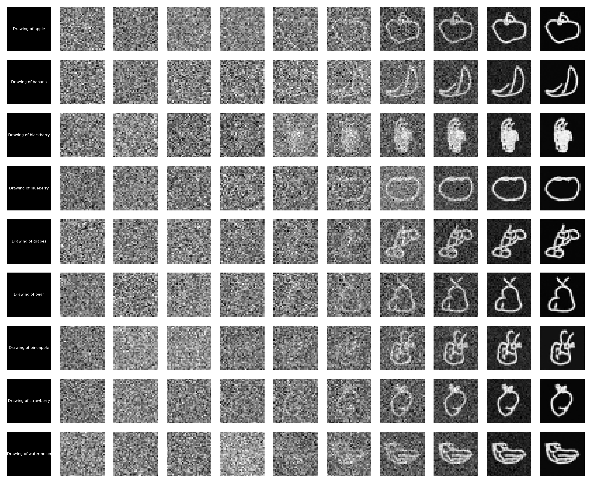
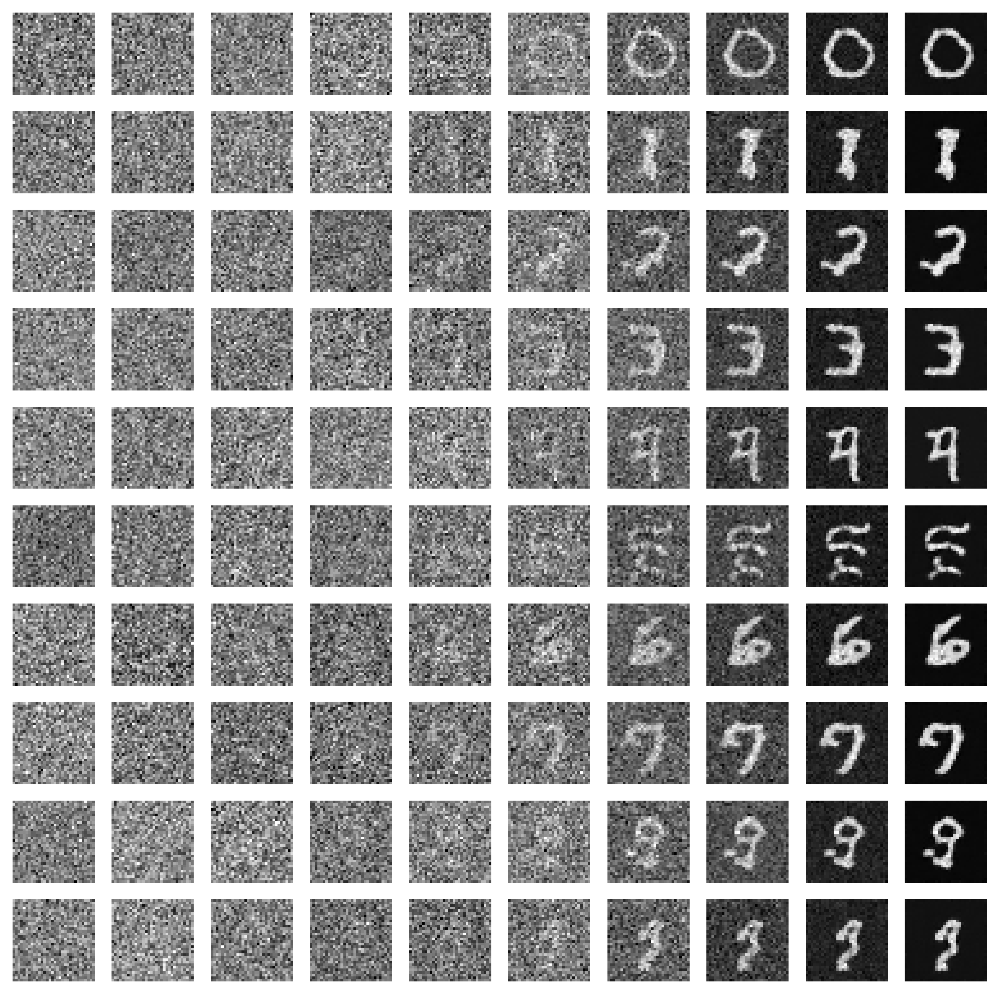

# Training a Text-Conditioned Diffusion Model
This repo contains training + eval code for a text-conditioned diffusion model, evaluated on the MNIST and Quickdraw datasets.
Some of the code in this repo was taken from [this blog](https://towardsdatascience.com/diffusion-model-from-scratch-in-pytorch-ddpm-9d9760528946/). 

## Architecture
We utilize the UNET architecture from the original [Denoising Diffusion Probabilistic Models (DDPM)](https://arxiv.org/abs/2006.11239), and add text conditioning by adding pre-trained CLIP encodings of text input to the sinusoidal positional embeddings in diffusion training. Both of those are added to the initial image before passing it into the UNET: The model outputs the predicted noise for a specified t. 

## Diffusion Parameters
Our model is trained with 1000 diffusion timesteps. Note that increasing this value does not directly slow down training, since we calculate directly the noise added at a given time t in training, rather than iteratively playing it forward. During inference, we start from an image of pure noise and iterately denoise it (for 1000 timesteps), resulting in the desired image. At each denoising step (which happens in reverse order from t = 1000 to t = 1), we query the model for the the predicted noise at time t, scale it by a constant and then subtract it from the image. This scaling and iterative subtracting is done in diffusion models for training stability and performance.

Our loss function is MSE loss between original noise and predicted noise at given time t. Gradient is accumulated and provided per batch. We use the following hyperparameters
1) a batch size of 642)
2) adam optimizer with an initial learning rate of 2e-6. 
3) 250 epochs

## Data
For the MNIST dataset, we used the entire training dataset of 60K images. For the quickdraw dataset, we used the [quickdraw-small](https://huggingface.co/datasets/Xenova/quickdraw-small) dataset and filtered our data to only pictures of fruits (9 classes), resulting in roughly 100K training images. 

## Training
We trained on 1 H100 (SXM5), with each epoch taking ~30s for the quickdraw dataset.  Pictured below is the avg loss per epoch during training (blue)

We also graph the avg loss per epoch only for early timesteps (t < 100) in the denoising process. This corresponds to timesteps of lower noise. Commonly with diffusion models, the high noise (high t) steps dominate the losses. When the overall loss plateaus, the model still is significantly improving since the model is getting better at predicting for the low t steps, which makes it better at keeping shapes intact + creating overall semantics.

As you can see, starting from epoch 100, the overall loss plateaus, but the t < 100 loss is still improving, indicating that the extra epochs are improving our model. Visual experiments also confirm this.

## Results
Results from inference denoising on the quickdraw dataset. Pictured here are examples from the 9 categories in order: apple, banana, blackberry, blueberry, grapes, pear, pineapple, strawberry, watermelon (each shown as a row). Each row shows the output from denoising iterations t = [999,700,550,400,300,200,100,50,15,0], so you can see how the model generates the images from pure noise. The text prompt: "Drawing of {fruit}", is shown at the beginning of the row.

The model seems to do a good job with more simple fruit shapes (apple, pear, etc), but struggles with fruits that have more texture (blackberry, pineapple)

Below are similar results for the MNIST dataset (prompted from 0 to 9).

## Conclusion
We implemented and trained a text-conditioned diffusion model from scratch to generate images of fruits or numbers. Our model training encountered similar trends to SOTA diffusion models (i.e learning low-noise semantics despite the overall loss plateauing, struggling with more complicated fruit textures). This repo is just meant to showcase a personal learning exercise, and should not be monetized or published externally.

